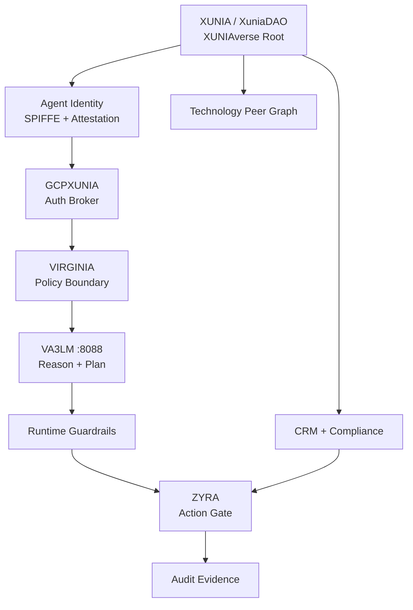

<div align="center">

# 🧅 XUNIA // XUNIAVERSE // GLASS ONION

### Main face, root ontology, defensive identity layer, CRM, compliance, licensing, market discovery, and governed execution fabric

**XuniaDAO is the root and front door of the XUNIAverse.**

**XUNIA → GCPXUNIA → VIRGINIA → VA3LM → ZYRA → SONOXO / GPT-DOUG-LLM → AlmightySonoxo → GPT-UAP-XO**

`GLASS ONION 2.6` · `XUNIAVERSE ROOT` · `AGENT IDENTITY` · `GCPXUNIA DEFENSE` · `VA3LM :8088` · `CRM ACTIVE` · `GDPR/HIPAA CONTROL MODEL` · `TECH PEER ONTOLOGY` · `PROVENANCE REQUIRED`

</div>

## XUNIAverse root

Command: **`/glass xuniaverse`**

`sonoxo/xuniadao` is the canonical registry and ontology root for the 57 Sonoxo repositories currently indexed in the XUNIAverse machine graph.

```text
XUNIA / XuniaDAO
  ├─ Core runtimes and products
  ├─ XUNIA extensions
  ├─ Defensive systems
  ├─ Product applications
  └─ Reference/upstream repositories
```

Every indexed repository keeps its own license, history, ownership, and upstream attribution. XUNIAverse membership does not rewrite an upstream project's ownership or imply vendor affiliation.

Registry: [`ecosystem/xuniaverse.json`](ecosystem/xuniaverse.json)

## Architecture

| Layer | Mission | Source |
|---|---|---|
| **XUNIA / XuniaDAO** | XUNIAverse root, registry, ontology, governance, CRM, compliance, licensing | [`sonoxo/xuniadao`](https://github.com/sonoxo/xuniadao) |
| **GCPXUNIA** | agent identity, auth brokering, cloud-defense policy model | [`docs/GCPXUNIA_DEFENSE.md`](docs/GCPXUNIA_DEFENSE.md) |
| **VIRGINIA** | policy boundary between identity/auth and agent execution | [`ecosystem/gcpxunia-defense.json`](ecosystem/gcpxunia-defense.json) |
| **VA3LM** | coding/reasoning runtime and defensive command center | [`gpt-doug-llm/va3lm`](https://github.com/sonoxo/gpt-doug-llm/tree/main/va3lm) · `127.0.0.1:8088` |
| **ZYRA** | workflows, routing, approvals, bounded execution | [`sonoxo/zyra`](https://github.com/sonoxo/zyra) |
| **SONOXO / GPT-DOUG-LLM** | model brain, ontology, defensive automation | [`sonoxo/gpt-doug-llm`](https://github.com/sonoxo/gpt-doug-llm) |
| **AlmightySonoxo** | creative/media layer | [`sonoxo/AlmightySonoxo`](https://github.com/sonoxo/AlmightySonoxo) |
| **GPT-UAP-XO** | bounded local agent runtime | [`sonoxo/gpt-uap-xo`](https://github.com/sonoxo/gpt-uap-xo) |



## GCPXUNIA / VIRGINIA / VA3LM defense

Command: **`/glass defense`**  
Identity route: **`/glass identity`**

```text
XUNIA_SCOPE
  → AGENT_IDENTITY_VERIFY
  → GCPXUNIA_AUTH_BROKER
  → VIRGINIA_POLICY_BOUNDARY
  → VA3LM_REASON_AND_PLAN
  → RUNTIME_GUARDRAIL
  → ZYRA_ACTION_GATE
  → AUDIT_EVIDENCE
```

The defensive model treats governed agents as first-class principals. It prefers SPIFFE-style agent identities, short-lived credentials, DPoP/mTLS token binding, least-privilege scopes, centralized auth brokering, separate user-delegated authority, explicit review for broad grants, runtime guardrails, and evidence logging. Shared or long-lived agent credentials are blocked by policy.

Docs: [`docs/GCPXUNIA_DEFENSE.md`](docs/GCPXUNIA_DEFENSE.md) · Contract: [`ecosystem/gcpxunia-defense.json`](ecosystem/gcpxunia-defense.json)

## Technology peer ontology

Command: **`/glass peers`**

XUNIA maintains an evidence-backed graph of credible technical peer/reference domains. Current references include Google Cloud Security Community, Google Security Operations, Google Threat Intelligence, Security Command Center, Security Validation, Cloud Security Foundation, and Palantir Ontology.

```text
TECH_PEER → SECURITY_DOMAIN → SOURCE → CREDENTIAL_EVIDENCE → ASSESSMENT
```

Peer-review/reviewer credentials are represented as evidence objects. Public credential or affiliation claims require evidence; community participation is not automatically promoted to vendor endorsement.

Docs: [`docs/TECH_PEERS.md`](docs/TECH_PEERS.md) · Contract: [`ecosystem/tech-peers.json`](ecosystem/tech-peers.json)

## Governance ontology

Command: **`/glass ontology governance`**

Architecture:

```text
OBJECT → PROPERTY → LINK → ACTION → EVIDENCE → DECISION
```

The ontology now spans repositories, licenses, tokens, exchanges, compliance requirements, agent identities, auth providers, access policies, runtimes, guardrails, security events, technology peers, security domains, XUNIAverse nodes, evidence, assessments, and attestations.

Contract: [`ecosystem/governance-ontology.json`](ecosystem/governance-ontology.json)

## CRM

Command: **`/glass crm`**

```text
ACCOUNT → CONTACT → LEAD → OPPORTUNITY → ACTIVITY → TASK → DEAL → CUSTOMER
```

Pipeline:

```text
CRM_INGEST → AIT_NORMALIZE → CRM_RELATIONSHIP_GRAPH → VA3LM_ANALYZE → ZYRA_WORKFLOW → UAP_AGENT_TASKS
```

Docs: [`docs/CRM.md`](docs/CRM.md) · Contract: [`ecosystem/crm.json`](ecosystem/crm.json)

## Bulk CRM data port

Command: **`/glass crm port`**

Supports bulk read, bulk write, export, import, and migration for `CSV`, `JSON`, `NDJSON`, and `ZIP_BUNDLE`, with schema mapping, dedupe, consent/provenance gates, dry-run, human approval, idempotent upsert, batching, audit, redaction, and rollback manifests.

Docs: [`docs/CRM_PORT.md`](docs/CRM_PORT.md) · Contract: [`ecosystem/crm-port.json`](ecosystem/crm-port.json)

## GDPR + HIPAA control model

Command: **`/glass certify crm`**

The repository implements the GDPR/HIPAA software and policy control model and keeps regulator/government certification claims false unless external operational evidence exists.

Docs: [`docs/GDPR_HIPAA.md`](docs/GDPR_HIPAA.md) · Contract: [`ecosystem/gdpr-hipaa.json`](ecosystem/gdpr-hipaa.json)

## Production compliance evidence

Command: **`/glass evidence`**

The evidence registry tracks real operational artifacts separately from source code and CI. Assessment states are `COMPLETE`, `PARTIAL`, or `MISSING`; code readiness is never automatically promoted to production compliance.

Docs: [`docs/COMPLIANCE_EVIDENCE.md`](docs/COMPLIANCE_EVIDENCE.md) · Contract: [`ecosystem/compliance-evidence.json`](ecosystem/compliance-evidence.json)

## Verified license registry

Command: **`/glass licenses`**

| Repository | License |
|---|---|
| `sonoxo/xuniadao` | `Apache-2.0` |
| `sonoxo/zyra` | `BUSL-1.1` → change license `Apache-2.0` under its stated rule |
| `sonoxo/gpt-doug-llm` | `MIT` |
| `sonoxo/AlmightySonoxo` | `MIT` |
| `sonoxo/gpt-uap-xo` | `Apache-2.0` |

Docs: [`docs/LICENSES.md`](docs/LICENSES.md) · Contract: [`ecosystem/licenses.json`](ecosystem/licenses.json)

## Live exchange market discovery

Command: **`/glass exchanges`**

GLASS ONION provides read-only adapters for Coinbase Exchange and Kraken public market-data APIs. It does not place orders, move funds, store exchange credentials, or self-declare exchange listings.

Docs: [`docs/EXCHANGES.md`](docs/EXCHANGES.md) · Contract: [`ecosystem/exchange-market.json`](ecosystem/exchange-market.json)

## XRPL documentation bridge

Command: **`/glass xrpl`**

XUNIA registers [`sonoxo/xrpl-dev-portalXUNIA`](https://github.com/sonoxo/xrpl-dev-portalXUNIA) as a federated, read-only documentation extension while preserving [`XRPLF/xrpl-dev-portal`](https://github.com/XRPLF/xrpl-dev-portal) as the authoritative upstream. This integration provides provenance and source resolution; it does not imply XRPLF endorsement and does not sign transactions, store wallet seeds, or move funds.

Docs: [`docs/XRPL_INTEGRATION.md`](docs/XRPL_INTEGRATION.md) · Contract: [`ecosystem/xrpl-documentation.json`](ecosystem/xrpl-documentation.json)

## XRPL token and wallet pathways

Command: **`/glass xrpl pathways`**

XUNIA connects standards ([`XRPL-StandardsXUNIA-`](https://github.com/sonoxo/XRPL-StandardsXUNIA-)), the TypeScript client ([`xrpl.jsXUNIA`](https://github.com/sonoxo/xrpl.jsXUNIA)), and the ledger node ([`rippledXUNIA`](https://github.com/sonoxo/rippledXUNIA)) through a governed token-and-wallet ontology. Public validated-ledger reads are allowed. Transaction construction is unsigned; signing and submission require human approval and a user-controlled external wallet. Seeds and private keys are blocked from repository and audit storage.

Docs: [`docs/XRPL_TOKEN_WALLET_PATHWAYS.md`](docs/XRPL_TOKEN_WALLET_PATHWAYS.md) · Contract: [`ecosystem/xrpl-token-wallet.json`](ecosystem/xrpl-token-wallet.json)

## AIT ontology

Command: **`/glass ait`**

Typed agents, systems, capabilities, sources, evidence, observations, hypotheses, decisions, workflows, actions, and controls with provenance-bearing relationships.

Contract: [`ecosystem/ait-ontology.json`](ecosystem/ait-ontology.json)

## GPT-UAP-XO

Command: **`/glass uap`**

```text
XUNIA_SCOPE → GPT_UAP_XO_PLAN → GPT_UAP_XO_BOUNDED_WORKERS → PROVENANCE_CHECK → ZYRA_ACTION_GATE
```

## Command surface

| Command | Purpose |
|---|---|
| `/glass` | GLASS ONION router |
| `/glass xuniaverse` | XUNIAverse repository/root registry |
| `/glass identity` | agent identity and auth-broker security |
| `/glass defense` | GCPXUNIA/VIRGINIA/VA3LM defensive pipeline |
| `/glass peers` | technology peer/source ontology |
| `/glass ontology governance` | unified governance ontology |
| `/glass ait` | AIT ontology/intelligence |
| `/glass crm` | CRM relationship/pipeline layer |
| `/glass crm port` | bulk CRM read/write/migration |
| `/glass certify crm` | CRM controls and internal attestation |
| `/glass evidence` | GDPR/HIPAA production evidence tracking |
| `/glass licenses` | verified repository license registry |
| `/glass exchanges` | live read-only exchange listing/ticker discovery |
| `/glass xrpl` | governed XRPL documentation and upstream source resolution |
| `/glass xrpl pathways` | token, wallet, client, node, approval and audit ontology |
| `/glass uap` | GPT-UAP-XO bounded-agent route |
| `/VA3LM-SAGI` | VA3LM guardrail intelligence surface |

## Guardrails

```text
XuniaDAO is XUNIAverse root                 YES
Agent identity before brokered auth         YES
Short-lived agent credentials               YES
Shared/long-lived agent credentials         NO
Broad agent grants without review           NO
Provenance required                          YES
Human review for consequential mutation      YES
External exchange listing self-declaration   NO
Exchange order placement                     NO
Code => production compliance inference      NO
Automatic fund movement                      NO
Automatic governance voting                  NO
Arbitrary remote shell                       NO
```

## Development

```bash
yarn install --frozen-lockfile
yarn build:main
yarn test:unit
```

GitHub Actions lock the XUNIAverse root registry, GCPXUNIA defense model, agent identity rules, technology peer ontology, ecosystem governance, CRM, compliance, licensing, exchange discovery, and evidence contracts.

## Source and affiliation boundary

The agent-identity/auth model is derived from public Google Cloud IAM and Google Cloud Security Community guidance. Palantir-style ontology alignment means object/property/link/action/function/governance modeling based on public Palantir documentation. These references do not claim Google or Palantir sponsorship, endorsement, partnership, or a live vendor deployment.

The Flow native token-registry code/data originated from the FlowFans community project. XUNIA preserves that provenance and attribution.

<div align="center">

### 🧅 XUNIAverse
**XuniaDAO at the root. Identity first. Evidence everywhere. Human command at the boundary.**

</div>
