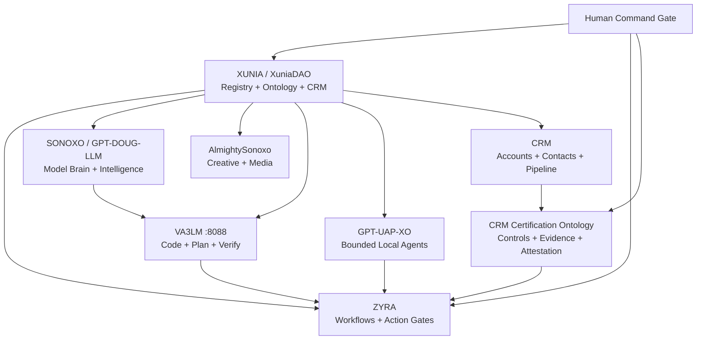

<div align="center">

# 🧅 XUNIA // GLASS ONION

### Agentic ecosystem registry, ontology, CRM, and governed execution fabric

**XUNIA → ZYRA → SONOXO / GPT-DOUG-LLM → AlmightySonoxo → VA3LM → GPT-UAP-XO**

`GLASS ONION` · `CRM ACTIVE` · `AIT BOUND` · `VA3LM :8088` · `PROVENANCE REQUIRED` · `HUMAN-GATED MUTATIONS`

[Architecture](#-architecture) · [CRM](#-glass-onion-crm) · [CRM Certification](#-crm-certification) · [Commands](#-command-surface) · [Development](#-development)

</div>

---

## ⚡ What this is

GLASS ONION is the XUNIA cross-repository intelligence and orchestration membrane. It connects six software layers while keeping each repository's history and runtime boundaries separate.

| Layer | Mission | Source |
|---|---|---|
| **XUNIA / XuniaDAO** | registry, ontology, metadata, governance intelligence, CRM contracts | [`sonoxo/xuniadao`](https://github.com/sonoxo/xuniadao) |
| **ZYRA** | workflows, routing, approvals, bounded execution | [`sonoxo/zyra`](https://github.com/sonoxo/zyra) |
| **SONOXO / GPT-DOUG-LLM** | model brain, intelligence ontology, defensive automation | [`sonoxo/gpt-doug-llm`](https://github.com/sonoxo/gpt-doug-llm) |
| **AlmightySonoxo** | creative, media, public-facing layer | [`sonoxo/AlmightySonoxo`](https://github.com/sonoxo/AlmightySonoxo) |
| **VA3LM** | coding/programming command center | [`gpt-doug-llm/va3lm`](https://github.com/sonoxo/gpt-doug-llm/tree/main/va3lm) · `127.0.0.1:8088` |
| **GPT-UAP-XO** | private local agent runtime with bounded parallel workers | `sonoxo/gpt-uap-xo` |

## 🧅 Architecture



## 💼 GLASS ONION CRM

Command: **`/glass crm`**

Core relationship model:

```text
ACCOUNT → CONTACT → LEAD → OPPORTUNITY → ACTIVITY → TASK → DEAL → CUSTOMER
```

Sales stages:

```text
NEW → QUALIFIED → DISCOVERY → PROPOSAL → NEGOTIATION → WON | LOST
```

Runtime path:

```text
CRM_INGEST
  → AIT_NORMALIZE
  → CRM_RELATIONSHIP_GRAPH
  → VA3LM_ANALYZE
  → ZYRA_WORKFLOW
  → UAP_AGENT_TASKS
```

CRM supports accounts, contacts, leads, opportunities, activities, tasks, deals, customers, pipeline metrics, open/won value aggregation, follow-up planning, and relationship graphing.

Documentation: [`docs/CRM.md`](docs/CRM.md)  
Machine contract: [`ecosystem/crm.json`](ecosystem/crm.json)

## 🛡️ CRM Certification

Command: **`/glass certify crm`**

The repository carries the **XUNIA CRM Internal Control Attestation**:

`XUNIA-CRM-ICA-1`

Current state: **`INTERNAL_ATTESTED`**

The certification model uses a Palantir-ontology-aligned structure:

```text
SYSTEM → CONTROL → EVIDENCE → ASSESSMENT → RISK → ATTESTATION
```

Objects:

`SYSTEM · CONTROL · EVIDENCE · ASSESSMENT · RISK · ATTESTATION`

Links:

`GOVERNS · SUPPORTED_BY · SATISFIES · BLOCKED_BY · APPLIES_TO · DERIVED_FROM`

Actions:

`ATTACH_EVIDENCE · RUN_CONTROL_CHECK · REQUEST_REVIEW · ISSUE_INTERNAL_ATTESTATION · REVOKE_ATTESTATION`

Internally attested code-level controls currently cover provenance, human review for CRM mutation, human review for external communication, human review for bulk outreach, and CI locking of the CRM contract.

External SOC 2, HIPAA, GDPR, CCPA, CAN-SPAM, and TCPA status is **readiness only / conditional**, not third-party certification. The machine contract explicitly prevents those claims from being represented as issued without separate evidence.

Certification details: [`docs/CRM_CERTIFICATION.md`](docs/CRM_CERTIFICATION.md)  
Machine attestation: [`ecosystem/crm-certification.json`](ecosystem/crm-certification.json)

## 🧠 AIT ontology

Command: **`/glass ait`**

AIT provides typed agents, systems, capabilities, sources, evidence, observations, hypotheses, decisions, workflows, actions, and controls with provenance-bearing relationships and governed promotion.

Contract: [`ecosystem/ait-ontology.json`](ecosystem/ait-ontology.json)

## 🛰️ GPT-UAP-XO

Command: **`/glass uap`**

Pipeline:

```text
XUNIA_SCOPE
  → GPT_UAP_XO_PLAN
  → GPT_UAP_XO_BOUNDED_WORKERS
  → PROVENANCE_CHECK
  → ZYRA_ACTION_GATE
```

Binding contract: [`ecosystem/gpt-uap-xo.json`](ecosystem/gpt-uap-xo.json)

## 🎛️ Command surface

| Command | Purpose |
|---|---|
| `/glass` | GLASS ONION routing surface |
| `/glass ait` | AIT ontology and intelligence pipeline |
| `/glass crm` | CRM relationship and pipeline layer |
| `/glass certify crm` | CRM control evidence and internal attestation |
| `/glass uap` | GPT-UAP-XO bounded local-agent route |
| `/VA3LM-SAGI` | VA3LM guardrail intelligence surface |

## 🔒 Command rules

```text
Provenance required                 YES
Human review for mutation           YES
Automatic fund movement             NO
Automatic governance voting         NO
Arbitrary remote shell              NO
```

Agents can analyze, plan, explain, test, and prepare reviewed actions. Consequential mutation remains human-gated.

## 🧬 XuniaDAO / Flow registry

This repository also contains a Sonoxo-hosted integration of the community Flow native token registry.

> Registry provenance: token-registry code and documentation originate from the FlowFans community project. Token metadata is infrastructure and does not by itself establish safety, value, endorsement, authenticity, or exchange listing.

## 🚀 One-command workspace

```bash
bash scripts/glass-onion-bootstrap.sh
```

VA3LM remains bound to `127.0.0.1:8088`. GPT-UAP-XO is a private layer and requires repository access when bootstrapping its source.

## ✅ Development

```bash
yarn install --frozen-lockfile
yarn build:main
yarn test:unit
```

GitHub Actions lock the Glass Onion ecosystem, AIT ontology, CRM contract, CRM certification ontology, and command routing before merge.

## Technology alignment boundary

The architecture contains integration patterns aligned with model, cloud, ontology, enterprise Linux, and developer-platform ecosystems. Palantir-style ontology alignment refers to the object/property/link/action pattern used in this codebase and does not claim Palantir sponsorship, endorsement, partnership, or a live Foundry deployment.

<div align="center">

### 🧅 GLASS ONION
**Six connected layers. CRM and evidence graphs. Human command at the boundary.**

</div>
