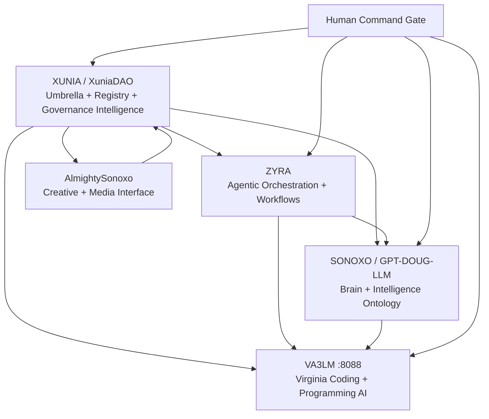

<div align="center">

# 🧅 XUNIA // GLASS ONION

### Agentic ecosystem command registry

**XUNIA → ZYRA → SONOXO / GPT-DOUG-LLM → AlmightySonoxo → VA3LM**

`CODE NAME: GLASS ONION` · `VA3LM: 8088` · `HUMAN-GATED MUTATIONS` · `PROVENANCE REQUIRED`

[Architecture](#-glass-onion-architecture) · [Five Layers](#-five-connected-layers) · [VA3LM 8088](#-va3lm--8088) · [Quick Start](#-one-command-workspace) · [Leadership](#-leadership-intelligence) · [XuniaDAO Registry](#-xuniadao--flow-registry)

</div>

---

## ⚡ What this is

**GLASS ONION** is the code name for the connected XUNIA ecosystem.

The job of this repository is to make the ecosystem understandable and machine-readable instead of leaving every project isolated in a separate repository.

```text
XUNIA            = umbrella + registry + DAO intelligence
ZYRA             = agentic orchestration + workflows
SONOXO           = GPT-DOUG-LLM brain + ontology + defensive intelligence
AlmightySonoxo   = creative + media + public-facing layer
VA3LM            = Virginia coding/programming AI command center on :8088
```

The component registry is implemented in [`src/lib/ecosystem.ts`](src/lib/ecosystem.ts), the machine-readable manifest lives at [`ecosystem/glass-onion.json`](ecosystem/glass-onion.json), and the VA3LM bridge lives at [`src/lib/va3lm.ts`](src/lib/va3lm.ts).

---

## 🧅 Glass Onion architecture



**Operating rule:** models and agents may analyze, plan, explain, test, and propose. Actions that mutate repositories, governance, funds, or production boundaries remain human-controlled.

---

## 🛰️ Five connected layers

| Layer | Mission | Repository / runtime |
|---|---|---|
| **XUNIA / XuniaDAO** | Ecosystem umbrella, registry, DAO metadata and integration intelligence | [`sonoxo/xuniadao`](https://github.com/sonoxo/xuniadao) |
| **ZYRA** | Agentic orchestration, workflows, routing and bounded execution | [`sonoxo/zyra`](https://github.com/sonoxo/zyra) |
| **SONOXO / GPT-DOUG-LLM** | Model brain, ontology, defensive intelligence and agent runtime | [`sonoxo/gpt-doug-llm`](https://github.com/sonoxo/gpt-doug-llm) |
| **AlmightySonoxo** | Creative, media and public-facing ecosystem layer | [`sonoxo/AlmightySonoxo`](https://github.com/sonoxo/AlmightySonoxo) |
| **VA3LM** | Virginia Agentic Large Learning Language Model coding/programming command center | [`gpt-doug-llm/va3lm`](https://github.com/sonoxo/gpt-doug-llm/tree/main/va3lm) · `127.0.0.1:8088` |

<details>
<summary><strong>👁️ Show the command flow</strong></summary>

```text
USER / OPERATOR
      │
      ▼
    XUNIA
      │
      ├──────────────► XuniaDAO registry / metadata
      │
      ▼
     ZYRA ───────────► workflows / agents / approvals
      │
      ▼
SONOXO / GPT-DOUG ───► reasoning / ontology / intelligence
      │
      ▼
  VA3LM :8088 ───────► code / debug / test / explain / plan
      │
      ▼
 HUMAN REVIEW ───────► accept / reject / deploy
```

</details>

<details>
<summary><strong>🧠 Show the machine-readable registry</strong></summary>

```typescript
import { GLASS_ONION, getXuniaLayer } from 'flow-native-token-registry';

console.log(GLASS_ONION.codename); // GLASS ONION
console.log(GLASS_ONION.layers);
console.log(getXuniaLayer('va3lm')?.runtime); // http://127.0.0.1:8088
```

</details>

---

## 🧠 VA3LM // 8088

VA3LM is the coding and programming intelligence layer embedded in `gpt-doug-llm`.

Its XuniaDAO client exposes read-oriented integration calls for:

- runtime status;
- agent roster;
- ontology inspection;
- coding plans;
- brain prompts;
- plain-language explainers.

```typescript
import { VA3LMClient } from 'flow-native-token-registry';

const va3lm = new VA3LMClient('http://127.0.0.1:8088');

const status = await va3lm.status();
const plan = await va3lm.plan('add a validated XUNIA ecosystem endpoint');
const explanation = await va3lm.explain('GLASS ONION');
```

The bridge does **not** receive wallet signing keys, automatic token-transfer authority, automatic governance voting, or arbitrary remote shell access.

---

## 🚀 One-command workspace

Clone/update all active Glass Onion source layers while preserving each repository's own history:

```bash
bash scripts/glass-onion-bootstrap.sh
```

Or choose the workspace location:

```bash
bash scripts/glass-onion-bootstrap.sh ~/glass-onion
```

Expected layout:

```text
glass-onion/
├── xunia/               # sonoxo/xuniadao
├── zyra/                # sonoxo/zyra
├── sonoxo/              # sonoxo/gpt-doug-llm
│   └── va3lm/           # VA3LM :8088
└── almighty-sonoxo/     # sonoxo/AlmightySonoxo
```

This approach links the ecosystem without destroying or rewriting the independent Git histories of the component projects.

---

## 🎖️ Leadership intelligence

XUNIA / GLASS ONION is led by a founder with certifications and credentials spanning technology ecosystems including:

**Anthropic / Claude · Google · Palantir · IBM / Red Hat · AWS**

Those areas are represented in the architecture as model, cloud, ontology, enterprise-Linux, governance and integration intelligence domains.

<details>
<summary><strong>Technology intelligence map</strong></summary>

| Ecosystem | Glass Onion integration focus |
|---|---|
| **Anthropic / Claude** | Model-provider and agent-reasoning interoperability |
| **Google** | AI, cloud, data and developer-platform integration |
| **Palantir** | Ontology, object/link, workflow and action-model architecture |
| **IBM / Red Hat** | Enterprise Linux, hybrid-cloud and governance integration |
| **AWS** | Cloud runtime, storage, identity and managed-service integration |

</details>

---

## 🔒 Command rules

GLASS ONION locks these ecosystem-level rules in code and tests:

```text
Human approval for mutation     REQUIRED
Automatic fund movement         DISABLED
Automatic governance voting     DISABLED
Arbitrary remote shell          DISABLED
Provenance                      REQUIRED
```

These controls allow agents to move quickly on analysis, coding, testing and planning while keeping consequential actions visible and accountable.

---

## 🎬 Plain-language commercial format

Every ecosystem product can be explained with the same six-beat structure used by the VA3LM explainer agent:

<details open>
<summary><strong>60-second explainer pattern</strong></summary>

1. **HOOK** — State the problem in one sentence.
2. **WHAT** — Name the XUNIA product solving it.
3. **HOW** — Show the workflow visually.
4. **PROOF** — Show a running command, test, ontology, dashboard or result.
5. **BENEFIT** — Explain what becomes faster, safer or easier.
6. **CTA** — Tell the viewer exactly what to do next.

</details>

---

## 🧬 XuniaDAO / Flow registry

XuniaDAO also contains a Sonoxo-hosted integration of the community Flow native token registry.

> **Registry provenance:** the token-registry code and documentation originate from the FlowFans community project. This repository does not claim original authorship of that upstream work. Token metadata is infrastructure and is not, by itself, a guarantee of safety, value, endorsement or authenticity.

### Query tokens

```typescript
import { TokenListProvider } from 'flow-native-token-registry';

new TokenListProvider().resolve().then((tokens) => {
  console.log(tokens.getList());
});
```

### Registry contribution rules

<details>
<summary><strong>Show token contribution requirements</strong></summary>

Token submissions remain scoped to the `token-registry` directory and should contain the required token metadata/artwork files, conform to the repository JSON schemas, and preserve valid Flow token addresses and provenance. Mainnet and testnet lists remain independently versioned.

</details>

---

## ✅ Development

```bash
yarn install --frozen-lockfile
yarn build:main
yarn test:unit
```

The Glass Onion ecosystem tests verify the five layer IDs, VA3LM `8088` binding, human approval controls and leadership credential-intelligence areas.

---

<div align="center">

## 🧅 GLASS ONION

**One ecosystem. Five connected layers. Human command at the boundary.**

</div>
