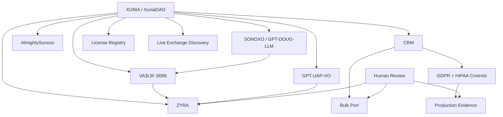

<div align="center">

# 🧅 XUNIA // GLASS ONION

### Agentic ecosystem registry, ontology, CRM, compliance, licensing, live market discovery, and governed execution fabric

**XUNIA → ZYRA → SONOXO / GPT-DOUG-LLM → AlmightySonoxo → VA3LM → GPT-UAP-XO**

`GLASS ONION 2.5` · `CRM ACTIVE` · `BULK PORT ACTIVE` · `GDPR/HIPAA CONTROL MODEL` · `LICENSES VERIFIED` · `LIVE EXCHANGE READS` · `AIT BOUND` · `PROVENANCE REQUIRED`

</div>

## What this is

GLASS ONION is XUNIA's cross-repository routing and evidence membrane. It connects six software layers while preserving repository boundaries, provenance, licensing, and human review for consequential mutations.

| Layer | Mission | Source |
|---|---|---|
| **XUNIA / XuniaDAO** | registry, ontology, CRM, compliance, licensing, token metadata | [`sonoxo/xuniadao`](https://github.com/sonoxo/xuniadao) |
| **ZYRA** | workflows, routing, approvals, bounded execution | [`sonoxo/zyra`](https://github.com/sonoxo/zyra) |
| **SONOXO / GPT-DOUG-LLM** | model brain, ontology, defensive automation | [`sonoxo/gpt-doug-llm`](https://github.com/sonoxo/gpt-doug-llm) |
| **AlmightySonoxo** | creative, media, public-facing layer | [`sonoxo/AlmightySonoxo`](https://github.com/sonoxo/AlmightySonoxo) |
| **VA3LM** | coding/programming command center | [`gpt-doug-llm/va3lm`](https://github.com/sonoxo/gpt-doug-llm/tree/main/va3lm) · `127.0.0.1:8088` |
| **GPT-UAP-XO** | bounded local agent runtime | [`sonoxo/gpt-uap-xo`](https://github.com/sonoxo/gpt-uap-xo) |



## CRM

Command: **`/glass crm`**

```text
ACCOUNT → CONTACT → LEAD → OPPORTUNITY → ACTIVITY → TASK → DEAL → CUSTOMER
```

Pipeline:

```text
CRM_INGEST → AIT_NORMALIZE → CRM_RELATIONSHIP_GRAPH → VA3LM_ANALYZE → ZYRA_WORKFLOW → UAP_AGENT_TASKS
```

Docs: [`docs/CRM.md`](docs/CRM.md) · Contract: [`ecosystem/crm.json`](ecosystem/crm.json)

## Bulk CRM data port

Command: **`/glass crm port`**

Supports **bulk read, bulk write, export, import, and migration** for `CSV`, `JSON`, `NDJSON`, and `ZIP_BUNDLE`, with schema mapping, dedupe, consent/provenance gates, dry-run, human approval, idempotent upsert, batching, audit, redaction, and rollback manifests.

Docs: [`docs/CRM_PORT.md`](docs/CRM_PORT.md) · Contract: [`ecosystem/crm-port.json`](ecosystem/crm-port.json)

## GDPR + HIPAA control model

Command: **`/glass certify crm`**

The repository implements the GDPR/HIPAA **software and policy control model** and keeps regulator/government certification claims false unless external evidence exists.

GDPR coverage includes principles, transparency, lawful basis, Article 9, data-subject rights, privacy by design, processor contracts, RoPA, security, breach response, DPIA/prior consultation, DPO governance, international transfers, and automated-decision safeguards.

HIPAA coverage includes scope determination, Privacy Rule controls, administrative/physical/technical safeguards, ePHI risk analysis and management, workforce security, contingency/disaster recovery, audit/integrity/authentication/transmission safeguards, BAAs/subcontractor flow-down, breach notification, periodic evaluation, and documentation retention.

Docs: [`docs/GDPR_HIPAA.md`](docs/GDPR_HIPAA.md) · Contract: [`ecosystem/gdpr-hipaa.json`](ecosystem/gdpr-hipaa.json)

## Production compliance evidence

Command: **`/glass evidence`**

The evidence registry tracks real operational artifacts separately from source code and CI. It models GDPR RoPA/lawful-basis/notices/DPIA/transfers/processors/DSR/breach evidence and HIPAA scope/ePHI inventory/risk/access/audit/integrity/physical/contingency/training/BAA/breach/evaluation evidence.

Assessment states are `COMPLETE`, `PARTIAL`, or `MISSING`; code readiness is never automatically promoted to production compliance.

Docs: [`docs/COMPLIANCE_EVIDENCE.md`](docs/COMPLIANCE_EVIDENCE.md) · Contract: [`ecosystem/compliance-evidence.json`](ecosystem/compliance-evidence.json)

## Verified license registry

Command: **`/glass licenses`**

Current repository licenses:

| Repository | License |
|---|---|
| `sonoxo/xuniadao` | `Apache-2.0` |
| `sonoxo/zyra` | `BUSL-1.1` → change license `Apache-2.0` under its stated rule |
| `sonoxo/gpt-doug-llm` | `MIT` |
| `sonoxo/AlmightySonoxo` | `MIT` |
| `sonoxo/gpt-uap-xo` | `Apache-2.0` |

Docs: [`docs/LICENSES.md`](docs/LICENSES.md) · Contract: [`ecosystem/licenses.json`](ecosystem/licenses.json)

## Live exchange market discovery

Command: **`/glass exchanges`**

GLASS ONION provides read-only adapters for Coinbase Exchange and Kraken public market-data APIs. It can discover live products/pairs, read tickers, and derive `LISTED_ACTIVE`, `LISTED_RESTRICTED`, `NOT_LISTED`, or `UNKNOWN` from exchange responses.

A registry entry or listing packet **does not make a token exchange-listed**. A listed claim requires the external exchange to expose/accept the market. The layer does not place orders, move funds, store exchange credentials, or automatically submit listings.

Docs: [`docs/EXCHANGES.md`](docs/EXCHANGES.md) · Contract: [`ecosystem/exchange-market.json`](ecosystem/exchange-market.json)

## AIT ontology

Command: **`/glass ait`**

Typed agents, systems, capabilities, sources, evidence, observations, hypotheses, decisions, workflows, actions, and controls with provenance-bearing relationships.

Contract: [`ecosystem/ait-ontology.json`](ecosystem/ait-ontology.json)

## GPT-UAP-XO

Command: **`/glass uap`**

```text
XUNIA_SCOPE → GPT_UAP_XO_PLAN → GPT_UAP_XO_BOUNDED_WORKERS → PROVENANCE_CHECK → ZYRA_ACTION_GATE
```

GPT-UAP-XO is now explicitly licensed under Apache-2.0 and its package metadata is CI-locked.

## Command surface

| Command | Purpose |
|---|---|
| `/glass` | GLASS ONION router |
| `/glass ait` | AIT ontology/intelligence |
| `/glass crm` | CRM relationship/pipeline layer |
| `/glass crm port` | Bulk CRM read/write/migration |
| `/glass certify crm` | CRM controls and internal attestation |
| `/glass evidence` | GDPR/HIPAA production evidence tracking |
| `/glass licenses` | Verified repository license registry |
| `/glass exchanges` | Live read-only exchange listing/ticker discovery |
| `/glass uap` | GPT-UAP-XO bounded-agent route |
| `/VA3LM-SAGI` | VA3LM guardrail intelligence surface |

## Guardrails

```text
Provenance required                          YES
Human review for consequential mutation      YES
Bulk CRM write approval                      YES
External exchange listing self-declaration   NO
Exchange order placement                     NO
Code => production compliance inference      NO
Automatic fund movement                      NO
Automatic governance voting                  NO
Arbitrary remote shell                       NO
```

## Package identity and upstream provenance

The npm package metadata now identifies this repository as **`xunia-glass-onion`**, points repository/homepage/bugs to `sonoxo/xuniadao`, uses SPDX `Apache-2.0`, and records the FlowFans token registry as upstream provenance.

> The Flow native token-registry code/data originated from the FlowFans community project. XUNIA preserves that provenance and attribution. Token metadata does not itself establish authenticity, safety, value, endorsement, or exchange listing.

## Development

```bash
yarn install --frozen-lockfile
yarn build:main
yarn test:unit
```

GitHub Actions lock the ecosystem, AIT, CRM, CRM bulk port, certification, GDPR/HIPAA controls, licenses, exchange adapters, production-evidence model, and command routing.

## Technology alignment boundary

Palantir-style ontology alignment means object/property/link/action modeling used in this codebase; it does not claim Palantir sponsorship, endorsement, partnership, or a live Foundry deployment. Likewise, GDPR/HIPAA software controls do not create regulator-issued certification, and exchange adapters do not create exchange listings.

<div align="center">

### 🧅 GLASS ONION
**Six connected layers. CRM, compliance, licensing, live market verification, and evidence graphs. Human command at the boundary.**

</div>
